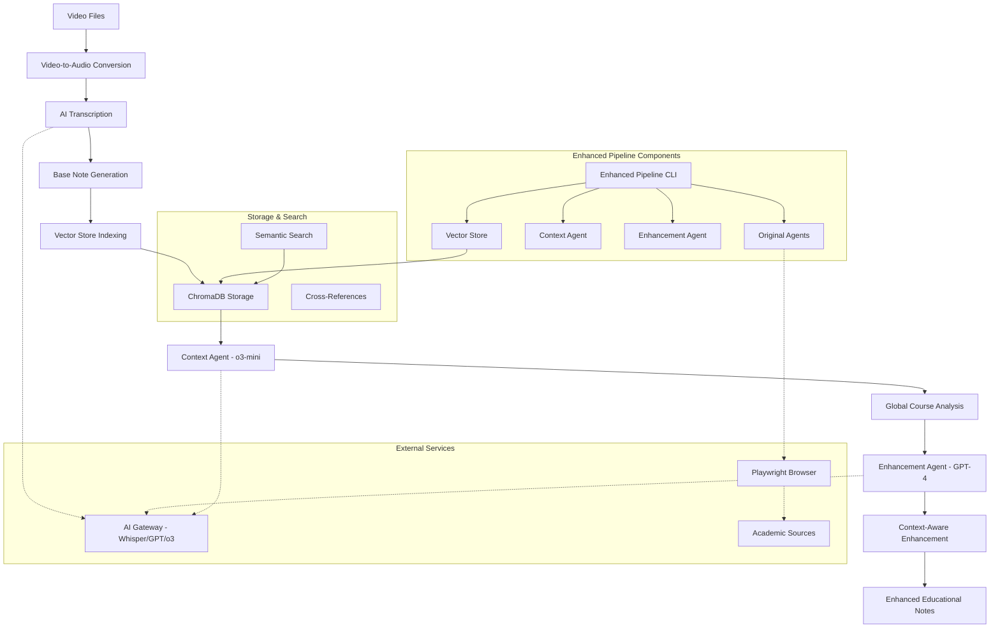

# Enhanced AudioToText Pipeline - Context-Aware Educational Content Processing

A comprehensive LangGraph-based agent system for processing video transcriptions and generating context-aware educational notes enhanced with internet research. Features multi-agent architecture with global course context analysis and vector-based semantic search.

## 🎯 Overview

The Enhanced AudioToText Pipeline transforms educational video content into context-aware, academically rigorous notes. The system uses a multi-agent architecture to analyze course structure, generate global context, and enhance individual notes with cross-references and comprehensive research.

## ✨ Key Features

### 🧠 Multi-Agent Architecture
- **LangGraph Orchestration**: Structured agent workflow for content processing
- **Context-Aware Processing**: Global course analysis using o3-mini
- **Note Enhancement**: GPT-4 powered enrichment with course-wide context
- **Vector Search**: ChromaDB-based semantic search across all content

### 📚 Educational Processing
- **Video-to-Audio Conversion**: Supports multiple video formats (MP4, AVI, MOV, MKV, WebM, FLV, WMV)
- **AI Transcription**: Powered by Whisper models through configurable AI gateways
- **Academic Note Generation**: Creates Obsidian-compatible markdown with cross-references
- **Course Structure Analysis**: Identifies relationships between lectures and topics
- **Concept Extraction**: Automatic identification of key educational concepts

### 🔍 Advanced Capabilities
- **Semantic Search**: Vector-based content discovery and retrieval
- **Web Research Integration**: Playwright MCP for real-time academic source verification
- **Fact-Checking**: Validates content against original transcripts and research
- **Reference Discovery**: Finds academic books, papers, and authoritative resources
- **Preview Mode**: Test enhancements before applying changes
- **Batch Processing**: Handles large course collections efficiently

### 🛡️ Security & Reliability
- **Input Validation**: Protection against path traversal and command injection
- **Credential Management**: Environment-based configuration with no hardcoded secrets
- **Graceful Interruption**: Ctrl+C support for clean process termination
- **Comprehensive Testing**: Full test suite with API-free quick tests

## 🏗️ Enhanced Architecture



## 🚀 Quick Start

### Prerequisites

- **Python 3.8+**
- **uv package manager**
- **Node.js 18+** (for Playwright MCP)
- **FFmpeg** (for video processing)
- **OpenAI-compatible API** with Whisper, GPT-4, and o3-mini access

### Installation

1. **Clone and setup environment:**
   ```bash
   git clone <repository-url>
   cd audiototext
   ```

2. **Install dependencies:**
   ```bash
   uv sync
   ```

3. **Configure environment:**
   ```bash
   cp .env.example .env
   # Edit .env with your API credentials
   ```

4. **Install Playwright browsers** (optional, for web research):
   ```bash
   npx playwright install chromium
   ```

### Configuration

Create a `.env` file with the following variables:

```env
# AI Gateway Configuration (REQUIRED)
BASE_URL=http://your-ai-gateway-url:port/path
API_KEY=your-api-key-here

# Enhanced Pipeline Models (REQUIRED)
CONTEXT_MODEL=o3-mini
ENHANCEMENT_MODEL=gpt-4
EMBEDDING_MODEL=text-embedding-3-small

# Directory Configuration (OPTIONAL)
INPUT_FOLDER=input_videos
OUTPUT_FOLDER=output_audio
TRANSCRIPTS_FOLDER=transcripts
KNOWLEDGE_BASE_FOLDER=knowledge_base

# Processing Configuration (OPTIONAL)
MAX_CHUNK_SIZE_MB=0.95
SUPPORTED_VIDEO_FORMATS=.mp4,.avi,.mov,.mkv,.webm,.flv,.wmv
```

**Important**: Replace placeholder values with your actual AI gateway configuration. The enhanced pipeline requires access to o3-mini, gpt-4, and embedding models.

## 📋 Usage

### Quick Start Commands

1. **Verify system setup:**
   ```bash
   uv run python test_quick.py
   ```

2. **Process videos to transcripts:**
   ```bash
   uv run python batch_transcribe.py
   ```

3. **Enhanced pipeline workflow:**
   ```bash
   # Index content into vector store
   uv run python enhanced_pipeline.py index
   
   # Generate global course context
   uv run python enhanced_pipeline.py context
   
   # Enhance notes with context
   uv run python enhanced_pipeline.py enhance
   
   # Search content semantically
   uv run python enhanced_pipeline.py search "neural networks"
   ```

### Enhanced Pipeline Commands

The enhanced pipeline provides a comprehensive CLI:

```bash
# Index existing content
uv run python enhanced_pipeline.py index [--force-reindex]

# Generate global context
uv run python enhanced_pipeline.py context [--course COURSE] [--save-as FILE]

# Enhance notes with context
uv run python enhanced_pipeline.py enhance [--no-backup] [--course COURSE] [--preview FILE]

# Run complete processing pipeline
uv run python enhanced_pipeline.py process

# Show system status
uv run python enhanced_pipeline.py status

# Search content
uv run python enhanced_pipeline.py search QUERY [--collection TYPE] [--limit N]
```

### Legacy Commands (Original Agents)

For backwards compatibility:

```bash
# Generate basic educational notes
uv run python agents.py batch               # Process all transcripts
uv run python agents.py path/to/file.md     # Process specific file
uv run python agents.py                     # Process default test file
```

### Enhanced Directory Structure

```
audiototext/
├── input_videos/              # Place your video files here
├── output_audio/              # Generated audio files (temporary)
├── transcripts/               # AI-generated transcriptions
├── knowledge_base/            # Enhanced educational notes (Obsidian-compatible)
├── chroma_db/                # Vector database storage
├── 
├── # Enhanced Pipeline Components
├── enhanced_pipeline.py       # Main CLI and orchestration
├── simple_vector_store.py     # ChromaDB vector storage
├── context_agent.py           # Global context generation (o3-mini)
├── enhancement_agent.py       # Note enhancement (GPT-4)
├── 
├── # Original Components  
├── agents.py                  # LangGraph academic note generation
├── batch_transcribe.py        # Video processing pipeline
├── video_to_audio.py          # FFmpeg wrapper utility
├── 
├── # Configuration & Testing
├── config.py                  # Configuration management
├── test_quick.py              # Quick test suite (no API calls)
├── test_comprehensive.py      # Full test suite
├── diagnose.py               # System diagnostics
├── 
├── # Environment & Documentation
├── .env                      # Environment configuration
├── .env.example              # Example configuration
├── README.md                 # This documentation
├── LICENSE                   # MIT license
└── pyproject.toml            # Project dependencies
```

## 🔧 Enhanced Multi-Agent Workflow

The enhanced pipeline uses a sophisticated multi-agent architecture:

### Phase 1: Base Processing (Original Agents)
1. **Content Extraction**: Parses transcript files and extracts educational content
2. **Concept Identification**: Uses AI to identify 3-7 main academic concepts  
3. **Web Research**: Playwright MCP searches Google Scholar, arXiv, and academic sources
4. **Deep Research**: Conducts comprehensive research on each identified concept
5. **Fact Checking**: Validates and corrects transcription errors against research
6. **Reference Discovery**: Finds relevant books, papers, and online resources
7. **Note Generation**: Creates structured, educational notes in Markdown format

### Phase 2: Context-Aware Enhancement
1. **Vector Indexing**: Stores transcripts and notes in ChromaDB for semantic search
2. **Course Analysis**: Context Agent (o3-mini) analyzes course structure and relationships
3. **Global Context**: Generates comprehensive course-wide context and topic mapping
4. **Enhancement**: Enhancement Agent (GPT-4) enriches notes with:
   - Cross-references to related lectures
   - Course-wide context integration
   - Concept relationship mapping
   - Validation against original transcripts
5. **Quality Assurance**: Preserves original content while adding valuable context

### Enhanced Output Features

Generated notes include:

#### Original Content (Preserved)
- **Lecture Overview**: Summary maintaining educational context
- **Instructor Examples**: All specific examples preserved exactly  
- **Technical Details**: Enhanced with research while preserving teaching style
- **Mathematical Concepts**: LaTeX notation for formulas
- **Reference Library**: Academic books, papers, and online resources

#### Enhanced Features (Added)
- **Cross-References**: Links to related lectures and concepts across the course
- **Course Context**: Integration with broader course themes and progression
- **Concept Relationships**: Visual mapping of how topics connect
- **Validation Markers**: Verification against original transcripts
- **Semantic Search**: Discoverable through vector-based queries
- **Obsidian Compatibility**: `[[concept]]` format for knowledge base navigation
- **Study Progression**: Learning path recommendations based on course structure

## 🌐 Web Research Integration

The system uses Playwright MCP for real-time web research:
- **Google Scholar**: Academic papers and citations
- **arXiv**: Recent research publications
- **University Resources**: Educational materials and course content
- **Headless Operation**: Runs invisibly in the background
- **Error Resilience**: Continues processing if web research fails

## 🛠️ Advanced Configuration

### Custom AI Gateway

The system is designed to work with any OpenAI-compatible API:
- Local Whisper deployments
- Cloud-based transcription services
- Custom AI gateway implementations

### File Naming Convention

The system automatically:
- Sanitizes filenames (lowercase, hyphens)
- Maintains directory structure
- Prevents duplicate processing
- Organizes output hierarchically

### Interruption Handling

Press `Ctrl+C` at any time to:
- Stop processing immediately
- Clean up resources gracefully
- Preserve completed work
- Display processing summary

## 🧪 Testing

The enhanced pipeline includes comprehensive testing:

### Quick Tests (Recommended)
```bash
uv run python test_quick.py
```
- No API calls required
- Tests all components and initialization
- 100% success rate expected
- Runs in ~2-3 seconds

### Comprehensive Tests (Full Coverage)
```bash
uv run python test_comprehensive.py
```
- Includes API interactions
- Creates test data and cleanup
- Full workflow validation
- May take several minutes

### Component-Specific Tests
```bash
uv run python test_enhancement_simple.py     # Enhancement agent only
uv run python test_phase3_enhancement.py     # Phase 3 validation
```

## 📚 Dependencies

Enhanced pipeline dependencies managed by `uv`:

### Core Framework
- **LangGraph**: Agent workflow orchestration
- **LangChain MCP Adapters**: Web research integration
- **ChromaDB**: Vector database for semantic search
- **OpenAI**: AI model client (GPT-4, o3-mini, embeddings)

### Processing & Utilities
- **pydub**: Audio processing
- **python-dotenv**: Environment configuration
- **SRT**: Subtitle file parsing
- **tqdm**: Progress visualization
- **Click**: CLI framework
- **Playwright**: Web automation (via MCP)

## 🤝 Contributing

This project uses modern Python tooling:
- **uv**: Fast dependency management
- **pyproject.toml**: Standard project configuration
- **Environment-based configuration**: Secure and flexible setup

## 📄 License

MIT License - see [LICENSE](LICENSE) file for details.

## 🆘 Troubleshooting

### Quick Diagnostics

1. **System Check**: Run quick tests first
   ```bash
   uv run python test_quick.py
   ```

2. **Pipeline Status**: Check system status
   ```bash
   uv run python enhanced_pipeline.py status
   ```

3. **Configuration Validation**: 
   ```bash
   uv run python diagnose.py
   ```

### Common Issues

#### Enhanced Pipeline Issues
1. **ChromaDB Connection Failed**
   ```bash
   # Remove and recreate database
   rm -rf chroma_db
   uv run python enhanced_pipeline.py index
   ```

2. **Vector Store Errors**
   ```bash
   # Check permissions and storage space
   ls -la chroma_db/
   df -h .
   ```

3. **API Rate Limits / Timeouts**
   ```bash
   # Use quick tests to avoid API calls
   uv run python test_quick.py
   # Check API configuration
   echo $BASE_URL $API_KEY
   ```

#### Legacy Issues  
4. **Missing Environment Variables**: Ensure `.env` file is properly configured
5. **Playwright Installation**: Run `npx playwright install chromium` if web research fails
6. **FFmpeg Not Found**: Install FFmpeg for video processing
7. **Python Version**: Requires Python 3.8 or higher

### Performance Issues

1. **Memory Issues**
   ```bash
   # Reduce chunk size in config.py
   CHUNK_SIZE = 200  # Default: 500
   ```

2. **Slow Processing**
   ```bash
   # Use preview mode for testing
   uv run python enhanced_pipeline.py enhance --preview file.md
   ```

### Recovery Commands

```bash
# Reset vector database
rm -rf chroma_db && uv run python enhanced_pipeline.py index

# Recreate environment
uv sync --reinstall

# Check system status
uv run python enhanced_pipeline.py status
```

### Support

**Phase 6 Complete!** The enhanced AudioToText pipeline is ready for production use with comprehensive documentation, testing, and troubleshooting guides.

---

**Jose Luis Rodrigues Da Silva** - MIT License