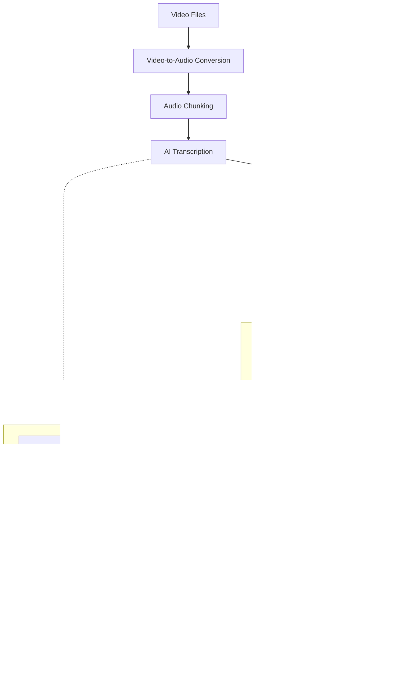

# AudioToText - Intelligent Educational Content Processing

A comprehensive Python-based system that converts video content to text transcriptions and generates intelligent educational notes using AI agents. Built with LangGraph and featuring web-enhanced research capabilities through Playwright MCP integration.

## 🎯 Overview

AudioToText is designed to transform educational video content into structured, searchable, and academically rigorous notes. The system preserves the instructor's voice, examples, and pedagogical flow while enhancing content with web-based research and fact-checking.

## ✨ Features

- **Video-to-Audio Conversion**: Supports multiple video formats (MP4, AVI, MOV, MKV, WebM, FLV, WMV)
- **AI Transcription**: Powered by Whisper models through configurable AI gateways
- **SRT Subtitle Extraction**: Processes accompanying subtitle files
- **Intelligent Agent System**: LangGraph-based workflow for content enhancement
- **Web Research Integration**: Playwright MCP for real-time academic source verification
- **Educational Note Generation**: Creates Obsidian-compatible markdown notes
- **Fact-Checking**: Corrects transcription errors and validates content
- **Reference Discovery**: Finds academic books, papers, and authoritative online resources
- **Batch Processing**: Handles multiple files with progress tracking
- **Graceful Interruption**: Ctrl+C support for clean process termination

## 🏗️ Architecture



## 🚀 Quick Start

### Prerequisites

- **Python 3.11+**
- **Node.js 18+** (for Playwright MCP)
- **FFmpeg** (for video processing)
- **AI Gateway** with Whisper model access

### Installation

1. **Clone the repository**
   ```bash
   git clone <your-repo-url>
   cd audiototext
   ```

2. **Install dependencies**
   ```bash
   uv sync
   ```

3. **Configure environment variables**
   ```bash
   cp .env.example .env
   # Edit .env with your configuration
   ```

4. **Install Playwright browsers** (optional, for web research)
   ```bash
   npx playwright install chromium
   ```

### Configuration

Create a `.env` file with the following variables:

```env
# AI Gateway Configuration (REQUIRED)
BASE_URL=http://your-ai-gateway-url:port/path
API_KEY=your-api-key-here

# Directory Configuration (OPTIONAL)
INPUT_FOLDER=input_videos
OUTPUT_FOLDER=output_audio
TRANSCRIPTS_FOLDER=transcripts
KNOWLEDGE_BASE_FOLDER=knowledge_base

# Processing Configuration (OPTIONAL)
MAX_CHUNK_SIZE_MB=0.95
SUPPORTED_VIDEO_FORMATS=.mp4,.avi,.mov,.mkv,.webm,.flv,.wmv
```

**Important**: Replace the placeholder values with your actual AI gateway configuration. The system will not run without proper `BASE_URL` and `API_KEY` values.

## 📋 Usage

### Basic Transcription

Process videos to generate transcriptions:

```bash
# Process all videos in input_videos/
uv run python batch_transcribe.py
```

### Generate Educational Notes

Create enhanced educational notes from transcriptions:

```bash
# Process all transcripts
uv run python agents.py batch

# Process a specific transcript
uv run python agents.py path/to/transcript.md

# Process with default test file (if available)
uv run python agents.py
```

### Directory Structure

```
audiototext/
├── input_videos/          # Place your video files here
├── output_audio/          # Generated audio files (temporary)
├── transcripts/           # AI-generated transcriptions
├── knowledge_base/        # Educational notes (Obsidian-compatible)
├── agents.py             # LangGraph agent system
├── batch_transcribe.py   # Video processing pipeline
└── video_to_audio.py     # FFmpeg wrapper utility
```

## 🔧 Agent Workflow Details

The LangGraph agent system processes transcriptions through a sophisticated pipeline:

1. **Content Extraction**: Parses transcript files and extracts educational content
2. **Concept Identification**: Uses AI to identify 3-7 main academic concepts
3. **Web Research**: Playwright MCP searches Google Scholar, arXiv, and academic sources
4. **Deep Research**: Conducts comprehensive research on each identified concept
5. **Fact Checking**: Validates and corrects transcription errors against research
6. **Reference Discovery**: Finds relevant books, papers, and online resources
7. **Note Generation**: Creates structured, educational notes in Markdown format

### Output Features

Generated notes include:
- **Lecture Overview**: Summary maintaining educational context
- **Instructor Examples**: All specific examples preserved exactly
- **Technical Details**: Enhanced with research while preserving teaching style
- **Mathematical Concepts**: LaTeX notation for formulas
- **Reference Library**: Academic books, papers, and online resources
- **Obsidian Links**: `[[concept]]` format for knowledge base navigation
- **Study Notes**: Key takeaways and learning objectives

## 🌐 Web Research Integration

The system uses Playwright MCP for real-time web research:
- **Google Scholar**: Academic papers and citations
- **arXiv**: Recent research publications
- **University Resources**: Educational materials and course content
- **Headless Operation**: Runs invisibly in the background
- **Error Resilience**: Continues processing if web research fails

## 🛠️ Advanced Configuration

### Custom AI Gateway

The system is designed to work with any OpenAI-compatible API:
- Local Whisper deployments
- Cloud-based transcription services
- Custom AI gateway implementations

### File Naming Convention

The system automatically:
- Sanitizes filenames (lowercase, hyphens)
- Maintains directory structure
- Prevents duplicate processing
- Organizes output hierarchically

### Interruption Handling

Press `Ctrl+C` at any time to:
- Stop processing immediately
- Clean up resources gracefully
- Preserve completed work
- Display processing summary

## 📚 Dependencies

Core dependencies managed by `uv`:
- **LangGraph**: Agent workflow orchestration
- **LangChain MCP Adapters**: Web research integration
- **OpenAI**: AI transcription client
- **Playwright**: Web automation (via MCP)
- **pydub**: Audio processing
- **python-dotenv**: Environment configuration
- **SRT**: Subtitle file parsing
- **tqdm**: Progress visualization

## 🤝 Contributing

This project uses modern Python tooling:
- **uv**: Fast dependency management
- **pyproject.toml**: Standard project configuration
- **Environment-based configuration**: Secure and flexible setup

## 📄 License

MIT License - see [LICENSE](LICENSE) file for details.

## 🆘 Troubleshooting

### Common Issues

1. **Missing Environment Variables**: Ensure `.env` file is properly configured
2. **Playwright Installation**: Run `npx playwright install chromium` if web research fails
3. **FFmpeg Not Found**: Install FFmpeg for video processing
4. **Python Version**: Requires Python 3.11 or higher

### Support

For issues and feature requests, please check the project documentation or create an issue in the repository.